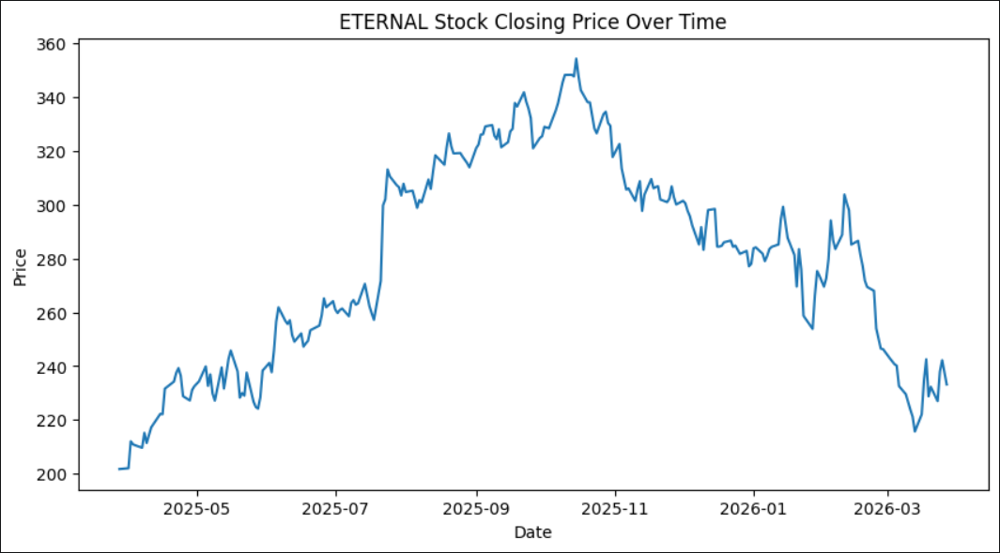
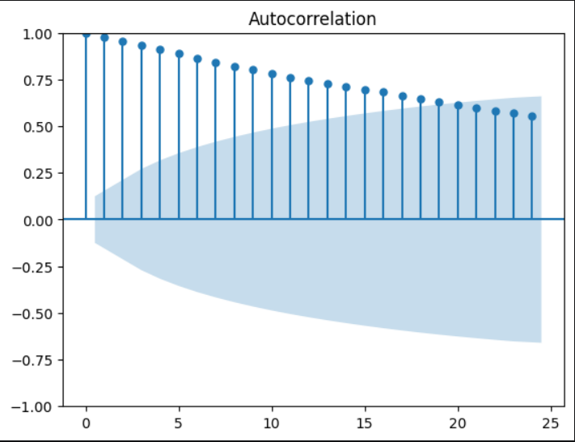
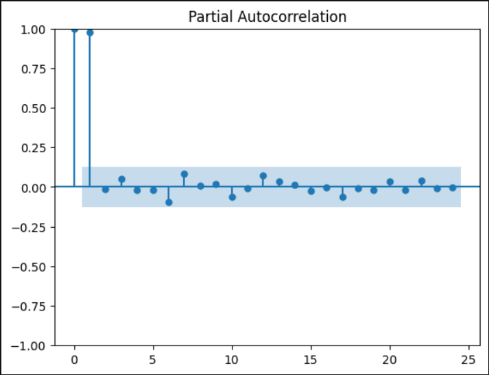
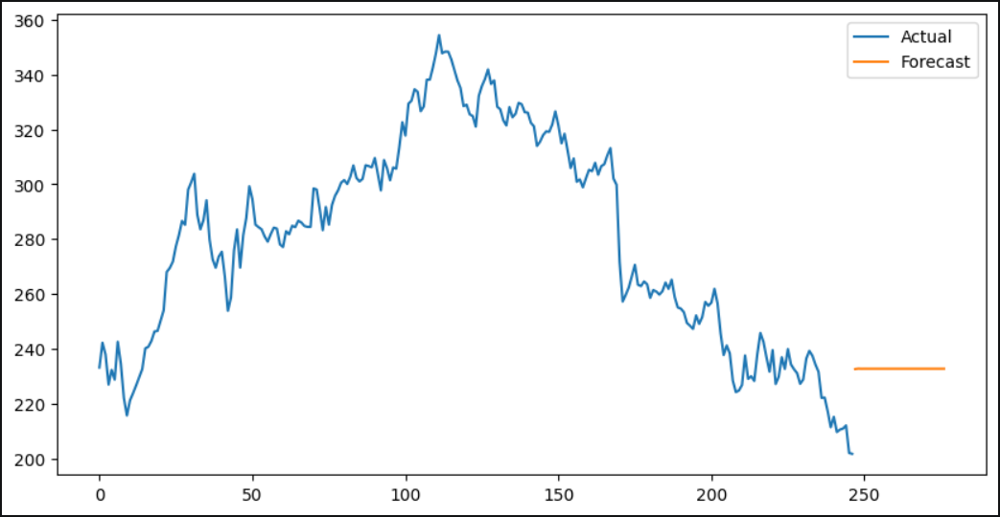

# Time Series Analysis of ETERNAL Stock (ARIMA Model)

## 📌 Executive Summary

This report presents a time series analysis of ETERNAL stock using the ARIMA model to understand historical trends and forecast future prices for the next 30 days.

---

## ⚙️ Methodology & Data Preprocessing

* Converted DATE column into datetime format
* Sorted data chronologically
* Checked and handled missing values
* Used closing price as primary feature

---

## 📈 Stock Price Trend

---

## 🔍 Stationarity Testing (ADF Test)

* ADF test indicated non-stationarity (p-value > 0.05)
* First-order differencing applied (d = 1)

---

## 📉 ACF and PACF Analysis

### ACF Plot

### PACF Plot

* AR (p) = 1 (from PACF)
* MA (q) = 1 (from ACF)
* Final model: ARIMA(1,1,1)

---

## 🤖 Model Implementation

The ARIMA(1,1,1) model was fitted on the closing price data to capture the trend and patterns in the time series.

---

## 🔮 Forecasting

### 📊 Insights

* Stock initially showed an upward trend
* Followed by a clear downward movement
* Forecast suggests stabilization around current price range

---

## ⚖️ Governance & Ethics

* Data Source: NSE (public data)
* No personal data used
* Model used only for academic purposes
* Market volatility and external factors considered

---

## ✅ Conclusion

The ARIMA(1,1,1) model effectively captured the stock behavior. The analysis indicates that the stock is transitioning from a downward trend to a stable phase with minor fluctuations expected in the short term.
